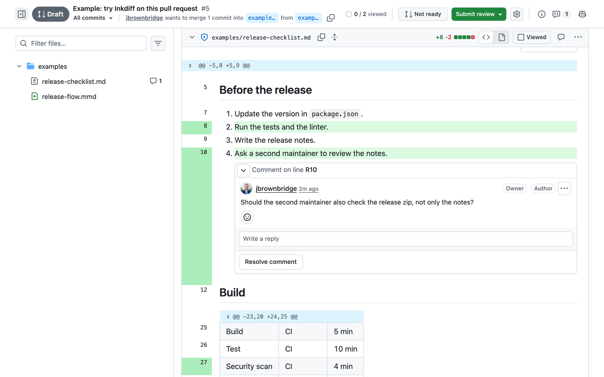
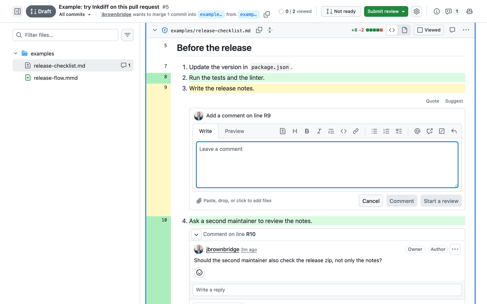
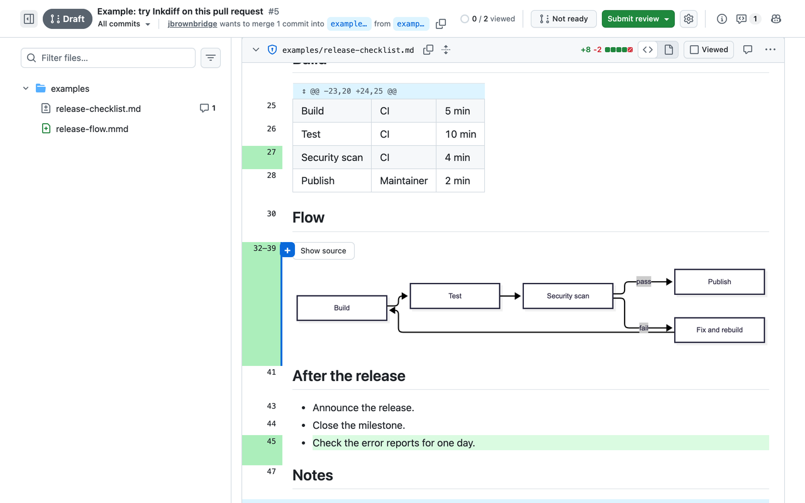
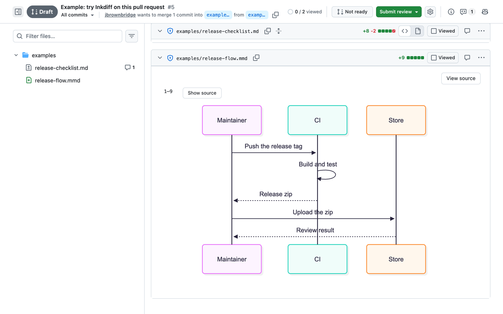

# Inkdiff

Reads github.com only. No servers. No tracking.

Review **rendered** Markdown in pull requests, and comment on the exact source lines.

Inkdiff is a Chrome extension for the "Files changed" page of a GitHub pull request. For each Markdown file (`.md`, `.mdx`, `.markdown`) and Mermaid file (`.mmd`), it shows the file as readers see it, with a line-number gutter that maps every block to its exact source lines.

## Features

- **Rendered review view.** Headings, lists, tables, front matter, code and diagrams, each mapped to its source lines. Changed lines are tinted, and removed lines show a marker.
- **Only what changed.** Like the source diff, it shows the changed sections, with expand arrows and a **Show whole file** toggle.
- **Comment the easy way.** Click a line, click or drag across line numbers, Shift-click to grow a range, or select text. The comment form is the site's own form, so drafts, suggestions, reviews and posting work as usual.
- **Threads in place.** Review threads show under their line with their full controls: reply, edit, delete, resolve and reactions. A **View rendered** button on each thread in the source diff takes you back.
- **Diagrams.** Mermaid diagrams render inside the view (on click, or automatically).
- **Fast.** No flash of the source diff on load. Sources are fetched in idle time and cached per commit.
- **Logged out.** Works read-only on public pull requests.

| Comment on a line | Diagrams in a Markdown file | Mermaid files |
|---|---|---|
|  |  |  |

Try it on the [example pull request](https://github.com/jbrownbridge/inkdiff/pull/5/files).

## Install

- From the Chrome Web Store: link coming soon.
- From source: see [Development](#development), then load `dist/` at `chrome://extensions` with **Load unpacked** (Developer mode on).

## Settings

Open the extension's options:

- **Open Markdown files rendered by default** (on)
- **Show only changed sections** (on)
- **Render Mermaid diagrams automatically** (off)

## Privacy and permissions

- `https://github.com/*`: to read the pull request page and each file's source at the pull request's head commit.
- `storage`: to keep your three settings, and to cache file sources until the browser closes.

Inkdiff talks only to GitHub's own servers (github.com and `*.githubusercontent.com`, where GitHub serves raw files and images). Everything it reads stays in your browser. See [PRIVACY.md](PRIVACY.md).

The Mermaid library ships inside the extension and loads only when a diagram renders. It is exposed to github.com pages only (`web_accessible_resources`). This is not a permission, and Chrome shows no warning for it.

## How it works

- `src/render`: Markdown to HTML with source positions on every block (remark, rehype), sanitized.
- `src/view`: the rendered panel, gutter, threads and comment UI.
- `src/github`: everything that reads or drives the page. All page selectors live in `src/github/selectors.ts`.
- `src/content`: starts Inkdiff on a page: finds files, opens each one (one controller per file), prefetches sources.
- `src/core`: page-independent logic: diff mapping, hunks, source fetching and caching, prefetch, kill switch.
- `src/background`: a tiny service worker that lets the content script keep sources in Chrome's extension session storage.
- `src/options`, `src/settings`: the options page and its settings.
- `src/page`: a tiny page-world script. It lets the page's own thread and form elements live inside the rendered view, and hides Markdown source diffs before the first paint.
- `killswitch.json`: versions listed here stay idle. Inkdiff reads it at most once a day, without cookies or Referer, so a page change that breaks it can be switched off without a store release.

## Development

    npm ci
    npm test             # unit tests
    npm run lint
    npm run typecheck
    npm run build        # writes dist/
    npm run package      # writes inkdiff-<version>.zip for the store

Manual checks: [docs/manual-test.md](docs/manual-test.md). Browser checks and fixtures: [CONTRIBUTING.md](CONTRIBUTING.md#setup).

## Contributing

See [CONTRIBUTING.md](CONTRIBUTING.md) (commits are signed off under the DCO). Report security issues privately: [SECURITY.md](SECURITY.md). How Inkdiff is protected: [docs/security.md](docs/security.md).

## License and disclaimer

Licensed under the [Apache License 2.0](LICENSE). See [NOTICE](NOTICE).

Inkdiff is provided "as is", without warranty of any kind, and the authors are not liable for any claim or damage arising from its use (sections 7 and 8 of the license). You are responsible for what you post through it.

"Inkdiff" and its logo are not licensed for use by forks: see [TRADEMARKS.md](TRADEMARKS.md).

GitHub is a trademark of GitHub, Inc. Inkdiff is not affiliated with, endorsed by, or sponsored by GitHub, Inc. or the Mermaid project.
