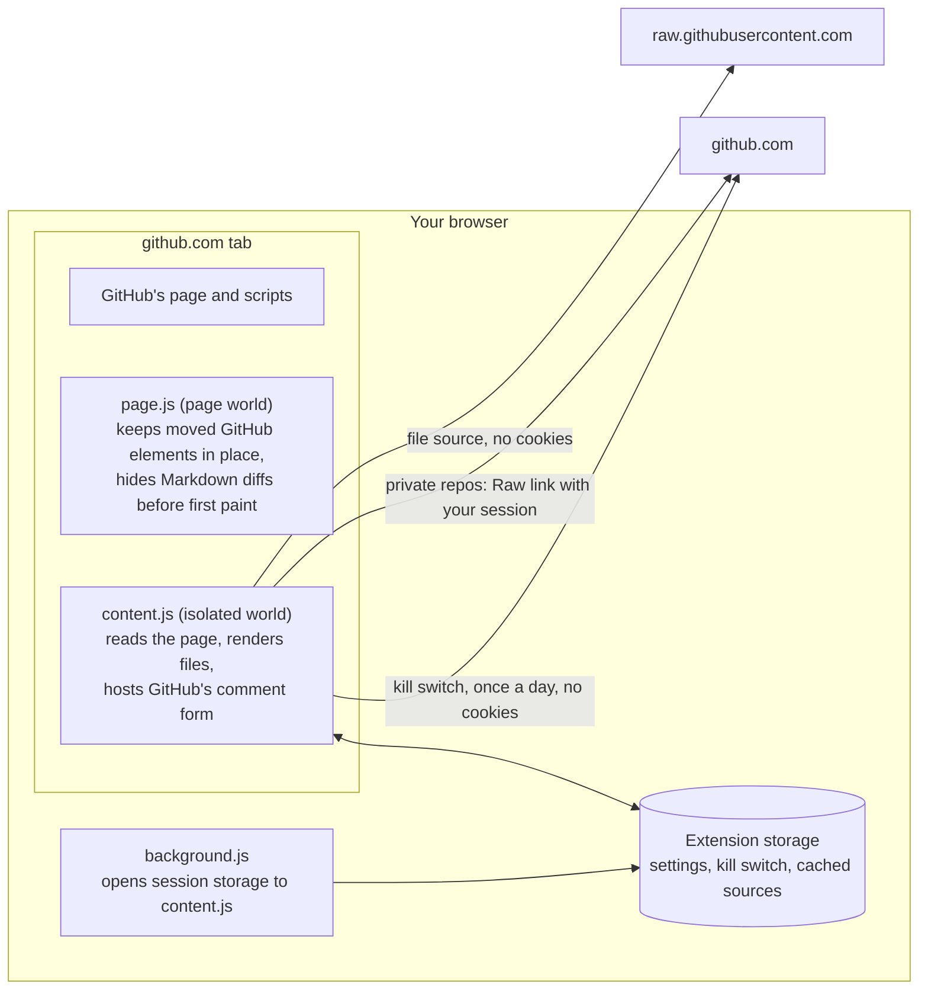
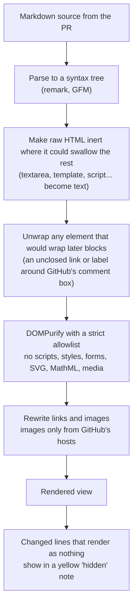
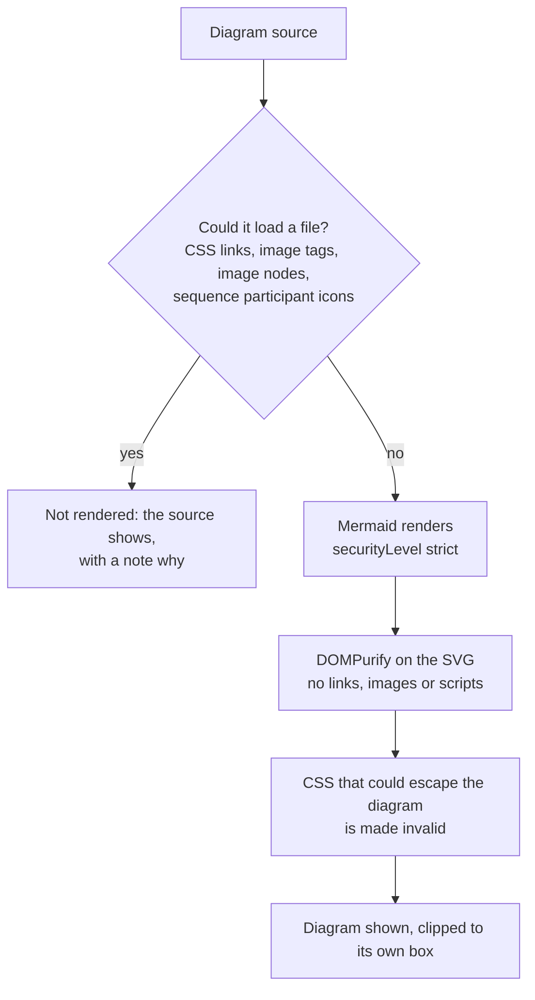
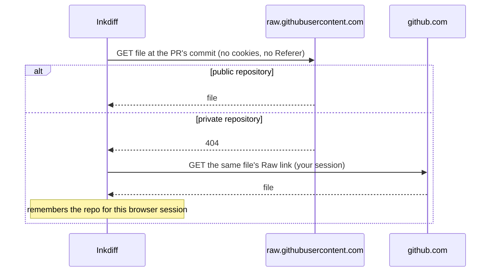

# How Inkdiff stays safe

Inkdiff shows Markdown and Mermaid files from pull requests as rendered documents inside github.com. Those files come from anyone who can open a pull request, so Inkdiff treats them as hostile. This page explains where the risks are and what stops each one. To report a problem, see [SECURITY.md](../SECURITY.md).

## What runs where

Inkdiff asks Chrome for one permission (`storage`) and one site (`https://github.com/*`). It has no server.

- **content.js** runs in Chrome's isolated world. Page scripts cannot read its variables or call its functions.
- **page.js** runs in the page's own world. It does one thing: GitHub's React code may try to remove a comment form or thread that Inkdiff has moved into its view. page.js stops that, but only for elements Inkdiff marked. It also sets one CSS class that hides Markdown source diffs until Inkdiff takes over.
- **background.js** has one job: it lets content.js use `chrome.storage.session`.

## Rendering untrusted Markdown

Every file passes through the same steps before anything reaches the page.

What each step stops:

| Risk | What stops it |
|---|---|
| Script in the Markdown | DOMPurify removes scripts, event handlers and `javascript:` links. |
| A fake login form or button | Forms, inputs and buttons are removed. |
| An unclosed `<a>` or `
<label>` that wraps GitHub's comment box, so a click there follows the attacker's link | Any element that would hold whole blocks is unwrapped, before and after sanitizing. |
| Content painted over GitHub's page | No style attributes, no inline SVG, and the view uses `contain: paint`. |
| Tracking images | Images load only from GitHub's own hosts. Other images become a plain link. |
| A change you cannot see (HTML comment, `[//]: #` line, hidden element) | Changed hidden content shows in a yellow note. Bidirectional text shows a warning, as on GitHub. |
| Page freezes from crafted input | The patterns that check author input run in linear time, and sources over 1 MB are not rendered. |

## Rendering Mermaid diagrams

Mermaid draws its diagram inside the page before Inkdiff can sanitize the result. So Inkdiff checks the diagram's source first, and refuses to render one that could make the browser load a file.

The source check decodes HTML entities, Mermaid entities and CSS, JSON and YAML escapes before it looks. A diagram's own settings cannot change the security level, the theme CSS or fonts.

## Reading file sources

- File paths and repository names are checked before any request, so a crafted path cannot point at another github.com page.
- Requests give up after 20 seconds, and files over 1 MB are refused.
- Prefetching reads at most 25 files per page, after the page has loaded, and stops on the first 403 or 429 answer.

## What is stored

| Data | Where | Who can read it | How long |
|---|---|---|---|
| Settings (3 on/off options) | `chrome.storage.sync` | Inkdiff only | Until you change them |
| Last kill-switch answer | `chrome.storage.local` | Inkdiff only | Refreshed daily |
| File sources | `chrome.storage.session` | Inkdiff only | Until the browser closes, or you change GitHub account |
| Unsent comment drafts | Memory | Inkdiff only | Until the page closes |
| "Open rendered by default" flag | github.com local storage | Scripts on github.com | Until you change the setting |

The flag in github.com's storage holds no content. It exists only so the first paint can hide the source diff.

## Kill switch

Once a day at most, Inkdiff reads [`killswitch.json`](../killswitch.json) from this repository, without cookies or a Referer. The file can turn off a whole version, or one feature (`host-threads`, `native-form`, `early-hide`) that then falls back to a safer mode. If GitHub changes its pages in a way that breaks Inkdiff, the maintainer can switch it off for everyone without a store release. The answer is kept in extension storage, where github.com pages cannot change it.

## Release integrity

- GitHub Actions are pinned to commit SHAs. Each workflow gets only the permissions it needs.
- The release build runs with a read-only token. The publish job runs no npm code.
- The release zip is reproducible: the same commit always gives the same bytes. Each release has a build provenance attestation.
- Dependencies are pinned in `package-lock.json`. Dependabot and CodeQL watch them, and `npm audit` reports no known vulnerabilities at release.

## Limits

- Scripts that already run on github.com can see what the rendered view shows, as they can see GitHub's own rich view.
- github.com pages can tell that Inkdiff is installed, because its diagram files have a fixed extension URL.
- Mermaid diagrams are protected by a source check. A later release will render them in a sandboxed extension page that cannot load files at all.
