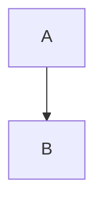

# Fixture guide

This paragraph has three lines
so that a selection can map to
an exact middle line.

- First item
- Second item
  - Nested item
- Third item

| Name | Value |
| ---- | ----- |
| alpha | 1 |
| beta | 2 |

> A quote that was added.



```ts
const answer = 42;
```

<details><summary>HTML block</summary>Hidden text.</details>

## Unchanged section

This paragraph does not change.
