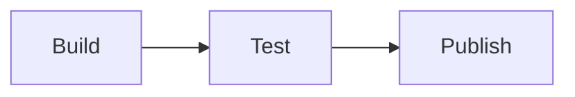

# Release checklist

This file is an example for trying Inkdiff. Open the pull request that changes it, and see the rendered view.

## Before the release

1. Update the version in `package.json`.
2. Run the tests.
3. Write the release notes.

## Build

Run the build and check the output folder.

```sh
npm ci
npm run build
```

## Steps

| Step | Owner | Time |
|---|---|---|
| Build | CI | 5 min |
| Test | CI | 10 min |
| Publish | Maintainer | 2 min |

## Flow



## After the release

- Announce the release.
- Close the milestone.

## Notes

Keep each release small. A small release is easy to review and easy to roll back.

If a step fails, stop and fix it before you continue.
